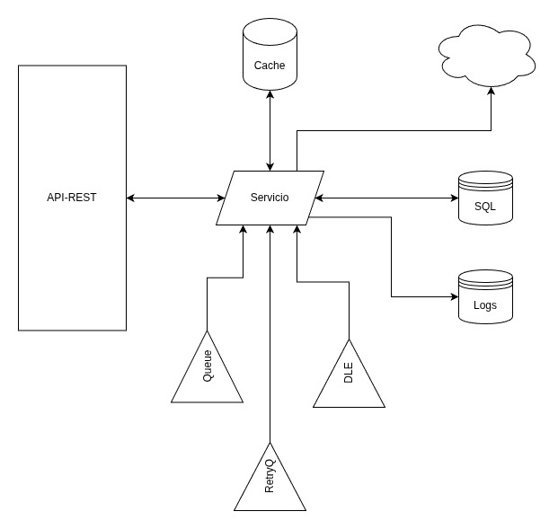
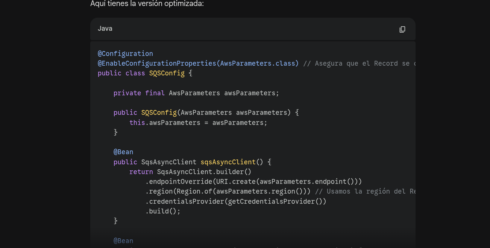
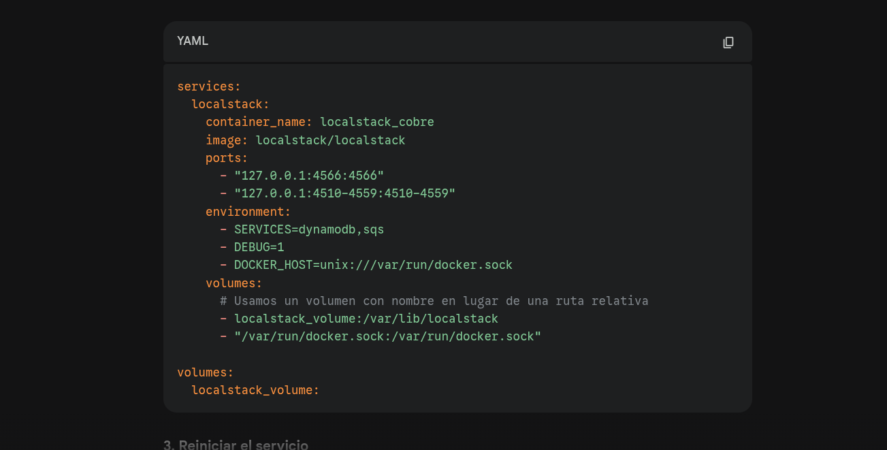
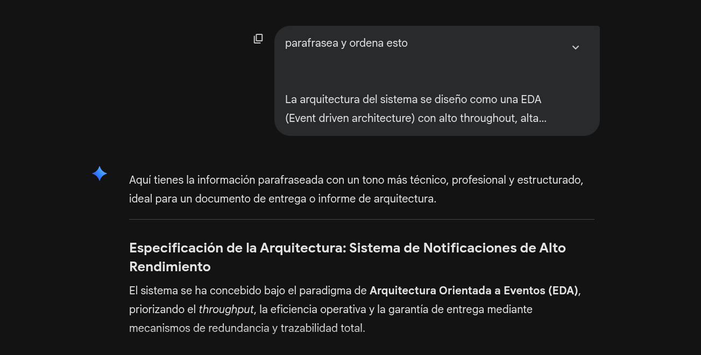

# Informe de Arquitectura: Sistema de Notificaciones Resiliente

## Diseño del sistema:

El sistema se ha concebido bajo el paradigma de Arquitectura Orientada a Eventos (EDA), priorizando el throughput, la eficiencia operativa y la garantía de entrega mediante mecanismos de redundancia y trazabilidad.
### Stack Tecnológico y Fundamentos
El núcleo del sistema es un microservicio desarrollado en Java con Spring WebFlux. Se optó por un modelo de programación reactiva (no bloqueante) para maximizar la capacidad de respuesta y gestionar un volumen masivo de peticiones concurrentes con una infraestructura mínima. Una base de datos SQL para consultas de información cruzada, una base de datos en memoria a modo de cache, una DB No_SQL y un sistema de mensajería desacoplado basado en colas. Todo esto montado sobre docker y LocalStack.

#### Infraestructura de Persistencia Políglota
Para optimizar el manejo de datos según su ciclo de vida, se implementó una estrategia de almacenamiento triple:

* Base de Datos SQL (PostgreSQL/R2DBC): Gestiona la lógica relacional y consultas cruzadas para asegurar la integridad de clientes y suscripciones.

* Base de Datos NoSQL (DynamoDB): Especializada en el almacenamiento de logs para auditoría.

* Capa de Caché (Redis): Optimiza el enrutamiento y la validación de clientes.

### Ciclo de Vida de la Notificación y Resiliencia

El flujo de datos está diseñado para garantizar que ninguna notificación se pierda, utilizando un sistema de mensajería basado en Amazon SQS. 

* Ingesta de eventos: El servicio procesa los eventos entrantes, validando las suscripciones activas del cliente.

* Ejecución: Se realiza el despacho al webhook correspondiente. Cada hito del proceso genera un log persistido en DynamoDB.

* Gestión de Errores (Retry Pattern): En caso de fallo en la entrega, el sistema no descarta la notificación; la envía a una Cola de Reintentos. Tras un periodo de 5 minutos, el proceso se reanuda automáticamente.

* Contención (DLQ): Si tras 5 intentos la entrega sigue siendo infructuosa, la notificación se marca como "Fallida" en la base de datos y se traslada a una Dead Letter Queue (DLQ) para su análisis técnico posterior.

### Modelo de Seguridad y Autenticación Stateless
Dada la ausencia de un sistema de identidad tradicional (OAuth2/OpenID), se implementó un sistema de Shared Secrets.

* Identificación en API: El cliente utiliza su secret_key como un token de acceso en los headers para realizar consultas a la API pública. Este secret key es usado para la valdiación y la consulta de datos del cliente, por lo que es obligatorio.

* Validación de Webhook: El sistema incluye esta llave en las cabeceras de las peticiones salientes. Esto permite que el cliente implemente un filtro de seguridad en su red (Firewall o API Gateway) para permitir únicamente el tráfico que contenga su valor secreto, garantizando la autenticidad del origen.

## Implementación de Inteligencia Artificial Generativa en el Ciclo de Vida del Desarrollo.

Para optimizar los tiempos de entrega y garantizar la adherencia a las mejores prácticas de la industria, se integró el uso de Inteligencia Artificial (IA) generativa como un colaborador estratégico durante todas las fases del proyecto, en este caso Gemini. Esta integración se centró en tres pilares fundamentales:

### Automatización de Código de Infraestructura y Soporte (Boilerplate)

La IA fue instrumental en la generación de componentes de bajo valor funcional pero de alta complejidad estructural. Esto incluye:

* Mapeo de Capas: Generación de Data Transfer Objects (DTOs), Entidades de Persistencia y Modelos de Dominio, asegurando una separación clara de responsabilidades bajo una arquitectura hexagonal.

* Adaptadores de Infraestructura: Configuración técnica de adaptadores reactivos para R2DBC, DynamoDB y Redis, reduciendo el margen de error humano en la implementación de clientes no bloqueantes.

* Aceleración del Desarrollo: Al delegar la escritura de código repetitivo a la IA, me pude centrar sus esfuerzos exclusivamente en la lógica de negocio crítica y en la orquestación de la resiliencia del sistema.

### Despliegue de Infraestructura como Código (IaC) y Entornos de Prueba

El uso de IA permitió una transición fluida hacia un modelo de desarrollo Cloud-Native, facilitando la creación de entornos de ejecución aislados y replicables:

* Orquestación con Docker & LocalStack: Se generaron configuraciones de docker-compose para emular el ecosistema de AWS localmente, garantizando que el microservicio interactuara con servicios reales de SQS y NoSQL desde el primer día.

* Aprovisionamiento con Terraform: La IA asistió en la definición de manifiestos de Terraform para la creación automatizada de recursos en la nube, permitiendo que la infraestructura fuera tratada con la misma rigurosidad y versionamiento que el código fuente.

### Colaboración en la Documentación Técnica y Síntesis Arquitectónica:

Más allá del código, la IA ha actuado como un arquitecto de soluciones y redactor técnico, colaborando activamente en la estructura de este informe (Incluyendo este parrafo). Su función ha consistido en:

* Refinamiento de la Narrativa: Transformar conceptos técnicos complejos en una documentación coherente, formal y estructurada.

* Validación de Conceptos: Asegurar que la justificación de cada componente (como el uso de WebFlux o la persistencia políglota) esté alineada con los estándares modernos de ingeniería de software.

* Síntesis de Información: Organizar el flujo del informe para que sea legible tanto para perfiles técnicos como para tomadores de decisiones, garantizando que la propuesta de valor del sistema sea clara y profesional.

## Seguridad presentes en el diseño de la API

Debido a que la API funciona con un sistema de llave secreta compartida, este sistema, por si solo, tiene carencias de seguridad que pueden y deben ser mitigadas en un ambiente productivo real mediante buenas practicas de desarrollo y gestión de riesgos. Ejemplos

1. Autenticación Deficiente (Broken Authentication): El Riesgo: Si la "llave secreta" o la cabecera personalizada no tienen un mecanismo de
rotación, son predecibles o se envían por canales no seguros, un atacante podría interceptarlas (Man-in-the-Middle) o deducirlas. Además, si la API no tiene Rate Limiting, un atacante podría hacer fuerza bruta sobre las llaves.

Medidas de Mitigación:

* Uso de Estándares: En lugar de una cabecera puramente personalizada,
implementar OAuth2 o JWT (JSON Web Tokens) firmados.
*  Protección en Tránsito: Forzar el uso de TLS 1.2+ (HTTPS) para que las
cabeceras nunca viajen en texto plano.
* Almacenamiento Seguro: No guardar las llaves en texto plano en la base de datos;
* usar algoritmos de hashing fuertes (como BCrypt o Argon2).

2. Falsificación de Solicitudes del Lado del servidor: Si un atacante consigue la llave secreta de un cliente, podría usar el servidor para enviar spam de notificaciones y saturar el webhook del servidor del cliente. por ejemplo usando el endpoint de retry, podrían re enviarse infinitamente notificaciones exitosas.

Medidas de Mitigación:

* Se podría limitar el numero de notificaciones exitosas que el cliente puede reenviar, o solo permitir notificaciones fallidas.

3. Consumo No Restringido de Recursos: Ocurre cuando la API no limita la cantidad de recursos que un cliente puede
solicitar. Por ejemplo el endpoint de getAllNotifications podría devolver cientos de miles de notificaciones que pueden hacer que el servidor falle por la enorme cantidad de información que maneja, sobretodo si esto se combina con peticiones multiples y repetidas.

Medidas de Mitigación:

* Rate Limiting: Implementar límites de peticiones por segundo/minuto por cada llave
de API (ej. usando Spring Boot con Bucket4j o un API Gateway).

* Paginación Estricta: Obligar el uso de parámetros limit y offset en el endpoint
de consulta masiva, con un máximo infranqueable (ej. máximo 100 registros por
página).

